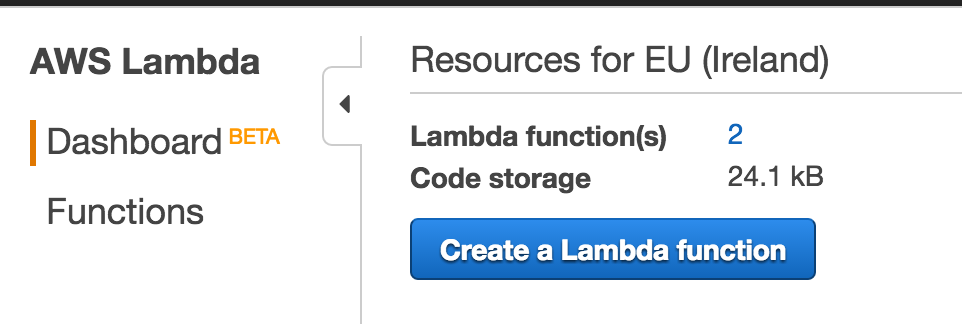
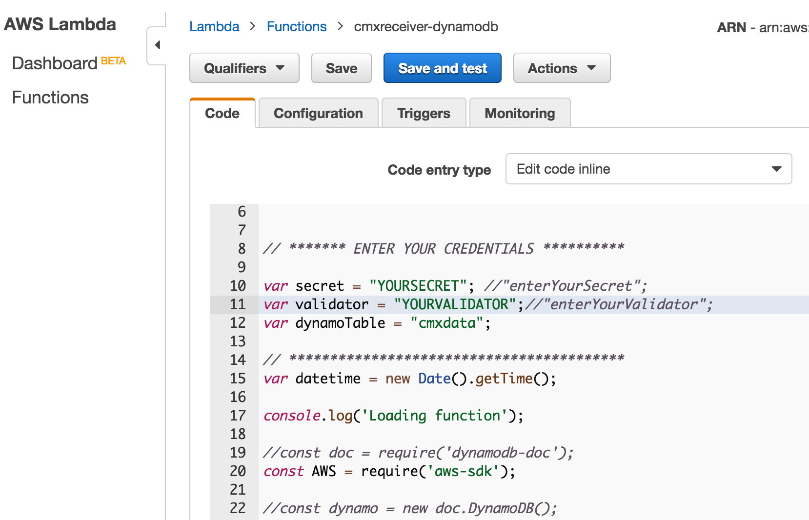

# Cisco Meraki Location Analytics
## CMX API using Amazon Lambda, DyanamoDB & ElasticSearch

This lab will walk through the process of building a
Meraki CMX WiFi location receiver using the AWS Lambda service by Amazon. The data will then be placed into DyanamoDB where it can be indexed and searchable using ElasticSearch and visualized with Kibana.

## Resources
### Docs
* [Cisco Meraki Developers Portal](https://developers.meraki.com)

### Source Code
* [CMX Lambda Function](src/cmx-lambda-inline.js)
* [CMX Lambda - POST Test](src/cmx-post-test.json)
* [CMX Lambda - GET Test](src/cmx-get-test.json)
* [DynamoDB to ElasticSearch Lambda](cmxreceiver-stream-to-es)

# Prerequisites
* Meraki Dashboard with MR Access Points
* Amazon AWS account and intermediate experience
* JavaScript & Python basic experience

# Technologies
##  Meraki CMX Location API
Cisco Meraki MR access points are capable of gathering location information using WiFi. By listening to client probe requests, the access points are able to triangulate and identify wireless clients. This information is then available via the CMX API. Meraki will periodically POST an array of JSON objects which  include the observations made by the network.

## AWS Lambda
Lambda is great way to run a small section of code as a micro-service, without the requirement of provisioning any hardware. By using the source code provided and an AWS API Gateway, a CMX receiver can be built pretty easily and scale on demand.

## AWS DynamoDB
DynamoDB is a NoSQL database service provide by Amazon AWS. It will provide a fast and reliable database for collecting the high volumes of CMX location data.

# Instructions

* Create a DynamoDB table
  * Table Name: "cmxdata"
  * Primary partition key: "message_id"
  * More Info: [DynamoDB Manual](http://docs.aws.amazon.com/amazondynamodb/latest/gettingstartedguide/Welcome.html)
  * 
* Create an AWS API Gateway
  * API Gateway Name: "CMX"
  * More Info: [API Gateway Manual](http://docs.aws.amazon.com/apigateway/latest/developerguide/create-api-resources-methods.html)
  * 
* Create an AWS Lambda Function
  * Name: "cmxreceiver-dynamodb"
  * *skip the triggers and blueprint screens*
  * More Info: [Lambda Manual](http://docs.aws.amazon.com/lambda/latest/dg/welcome.html)
  * 
* Copy the provided JavaScript code into the in-line Code editor
  * Source Code: [CMX Lambda Function](src/cmx-lambda-inline.js)
  * Update the **secret** and **validator** to match your settings Meraki Dashboard settings of the CMX POST URL.
  * 
* Create an IAM service role (Configuration tab) with full access to DynamoDB.
  * 
* Edit the Trigger for the Lambda function
  * Trigger: API Gateway
  * API Name: "CMX"
  * Security: "Open"
  * 
* The API Gateway trigger will now have a link to be used as your **CMX POST URL**
  * 

## Verify
* Use the [CMX Lambda - GET Test](src/cmx-get-test.json) to verify that your CMX receiver is responding with your validator key

# Configure Meraki CMX POST URL
* Login to your Meraki Dashboard
* Network-wide --> Settings
* * Add a Post URL: *yourserver*

# AWS DynamoDB

# AWS ElasticSearch & Kibana
Once the location data is stored in DynamoDB, indexing and data visualization are best handled by ElasticSearch and Kibana. ElasticSearch will index the database and provide a RESTful API to interact with the data. Kibana leverages this API and builds a flexible reporting and visualization tool.

Configuring these tools is primarily an exercise with AWS and permissions. To complete these steps, please read the following article.

https://aws.amazon.com/blogs/compute/indexing-amazon-dynamodb-content-with-amazon-elasticsearch-service-using-aws-lambda/

# Kibana Examples

